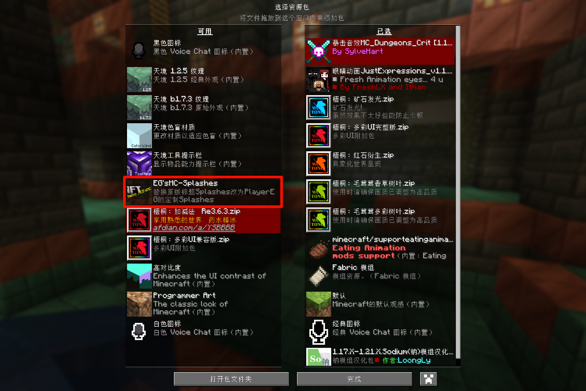

# PlayerEG的MC-Splashes

## 效果

替换原版标题Splashes改为定制Splashes

---

## 使用方式

1. 更改`assets\minecraft\texts\splashes.txt`内容

    

2. 将其作为MC资源包加载

    

---

## 🌐 关于我 🌐

### ♠️ 邮箱1：<email-e@playereg.top>

### ♣️ 邮箱2：<email-g@playereg.top>

### ♥️ GitHub主页：[@Ender-g](https://github.com/ender-g)

### ♦️ B站主页：[@PlayerEG](https://space.bilibili.com/520500365)

